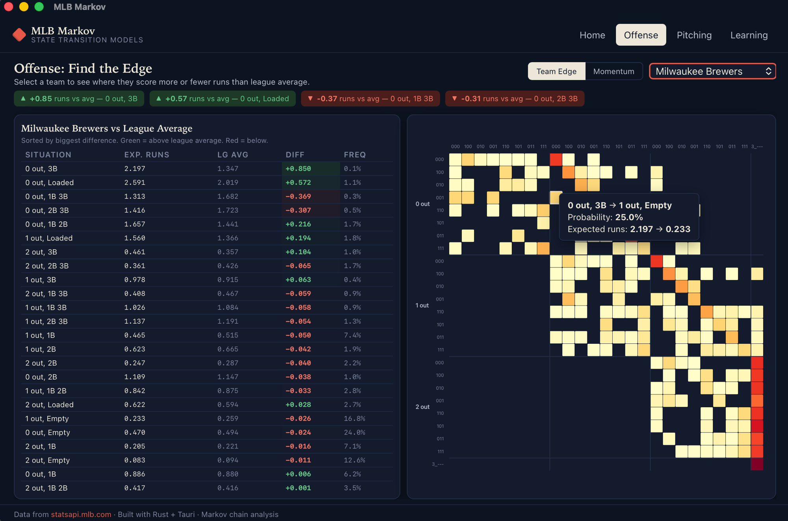
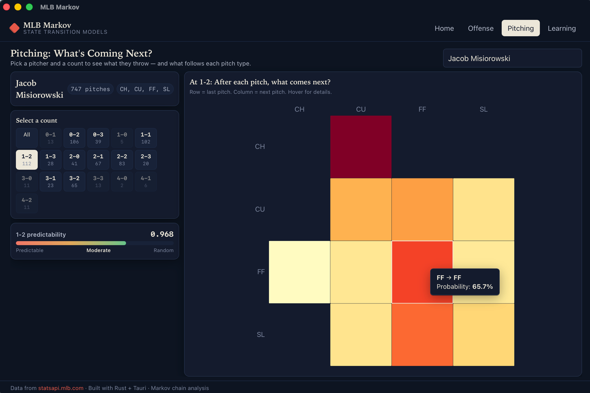

# MLB Markov

A desktop app that applies Markov chain models to real MLB play-by-play data. Built with [Tauri v2](https://v2.tauri.app) (Rust + SvelteKit). Data from the free [MLB Stats API](https://statsapi.mlb.com).

## Screenshots





## What It Does

### Offense: What Happens Next?
Every at-bat moves the game between base/out situations. This model tracks every transition and computes how many runs teams actually score from each situation.

- **Team vs League Average** — select any team and see where they score more or fewer runs than average, sorted by biggest difference
- **Momentum Analysis** — do teams score more from the same situation when runs have already scored in the inning? The data answers it
- **Trace the chain** — hover any cell in the heatmap to see the transition probability and how expected runs change from one state to the next

### Pitching: What's Coming Next?
Look up any pitcher and see what they throw at every count.

- **Count-specific sequences** — select a count (0-2, 3-1, etc.) to see the pitch-to-pitch transition matrix for that count. After a fastball at 0-2, what comes next?
- **Predictability score** — measures how easy it is to guess the next pitch. Updates per count so you can see where a pitcher becomes predictable
- **Full pitch type coverage** — tracks every pitch type in the pitcher's arsenal across the entire season

### Learning Tab
Built-in educational content explaining Markov chains, the 25 base-out states, run expectancy math, transition matrices, Shannon entropy, and the data pipeline. Formulas rendered with KaTeX.

## Getting Started

There's no prebuilt download — you run the app by building it from source. That sounds intimidating, but it's three commands once the tools are installed, and the whole thing takes about 10 minutes the first time. No prior Rust or web-dev experience needed.

### Step 1 — Install the tools

This app is built with [Tauri](https://v2.tauri.app), which needs three things plus some OS-level libraries:

| Tool | What it is | Install |
|------|-----------|---------|
| **Rust** | Powers the app's backend and the math engine | [rustup.rs](https://rustup.rs) — run the one-line installer, accept the defaults |
| **Node.js** (18+) | Runs the web-based interface during build | [nodejs.org](https://nodejs.org) — grab the "LTS" version |
| **pnpm** (10+) | Installs the interface's dependencies | After Node is installed, run `npm install -g pnpm` |

You also need your platform's build dependencies for Tauri. Pick your OS:

- **macOS** — install Xcode Command Line Tools: `xcode-select --install`
- **Windows** — install the [Microsoft C++ Build Tools](https://visualstudio.microsoft.com/visual-cpp-build-tools/) and [WebView2](https://developer.microsoft.com/microsoft-edge/webview2/) (preinstalled on Windows 11)
- **Linux** — install the WebKit/GTK packages listed in the [Tauri Linux setup guide](https://v2.tauri.app/start/prerequisites/#linux)

> Full, always-current details are in the [Tauri prerequisites guide](https://v2.tauri.app/start/prerequisites/) if anything above is unclear.

### Step 2 — Get the code and run it

```bash
git clone https://github.com/WalrusQuant/mlb-markov.git
cd mlb-markov
pnpm install      # downloads the interface dependencies (one time)
pnpm tauri dev    # builds and launches the app
```

The first `pnpm tauri dev` compiles the Rust backend, so it can take a few minutes. After that it's fast. A desktop window will open when it's ready.

### Step 3 — Load the data

The app ships empty — there's no baseball data inside it. On first launch, click **"Bootstrap Current Season"** on the Home tab to download play-by-play data for every completed game this season. Once it finishes, the Offense and Pitching tabs come to life.

### Building a standalone app (optional)

To produce a double-clickable installer instead of running in dev mode:

```bash
pnpm tauri build
```

The finished app lands in `src-tauri/target/release/bundle/`.

## Data Pipeline

Everything the app shows is computed from data you download yourself on first launch.

- **Initial load:** 800+ games, 60,000+ plays, 200,000+ pitches. Takes about 3-4 minutes.
- **Updates:** After the first load, click "Update Data" to pull only new games since your last import. Typically 12-15 games per day — a few seconds.
- **All local:** Everything is stored in a SQLite database on your machine. No account, no cloud, no API key.

## Tech Stack

| Layer | Technology |
|-------|-----------|
| Desktop shell | Tauri v2 |
| Backend | Rust (reqwest, rusqlite, serde, tokio) |
| Frontend | SvelteKit (adapter-static, Svelte 5) |
| Charts | D3.js (SVG heatmaps with interactive tooltips) |
| Math rendering | KaTeX |
| Database | SQLite (WAL mode, bundled via rusqlite) |
| Data source | MLB Stats API (free, no key) |

## Architecture

```
src-tauri/src/
├── api/           MLB Stats API client (schedule, play-by-play parser)
├── commands/      Tauri IPC commands (data, offense, pitching)
├── db/            SQLite setup, schema, migrations
├── markov/        Core math (states, transitions, expected runs, momentum, entropy)
└── lib.rs         AppState, setup, season detection

src/
├── lib/
│   ├── charts/    D3.js heatmap renderer with tooltips
│   ├── components/  Svelte 5 components
│   │   ├── StateHeatmap.svelte       25-state offense heatmap
│   │   ├── RunComparisonTable.svelte  Team vs league comparison
│   │   ├── MomentumTable.svelte       Cold vs hot innings
│   │   ├── InsightCallouts.svelte     Highlight biggest differences
│   │   ├── PitchMatrix.svelte         Pitch-type transition heatmap
│   │   ├── ExpectedRunsTable.svelte   RE24 table
│   │   └── TeamSelector.svelte        Team dropdown
│   ├── api.ts     Tauri invoke wrappers
│   └── types.ts   TypeScript types matching Rust serialization
└── routes/
    ├── +page.svelte          Home (data status, import, use cases)
    ├── offense/+page.svelte  Team edge + momentum analysis
    ├── pitching/+page.svelte Count-specific pitch sequencing
    └── learning/+page.svelte Educational content
```

## License

MIT
